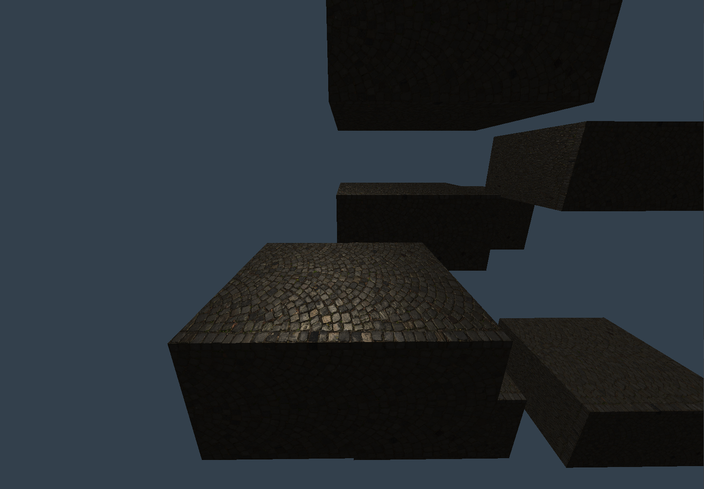
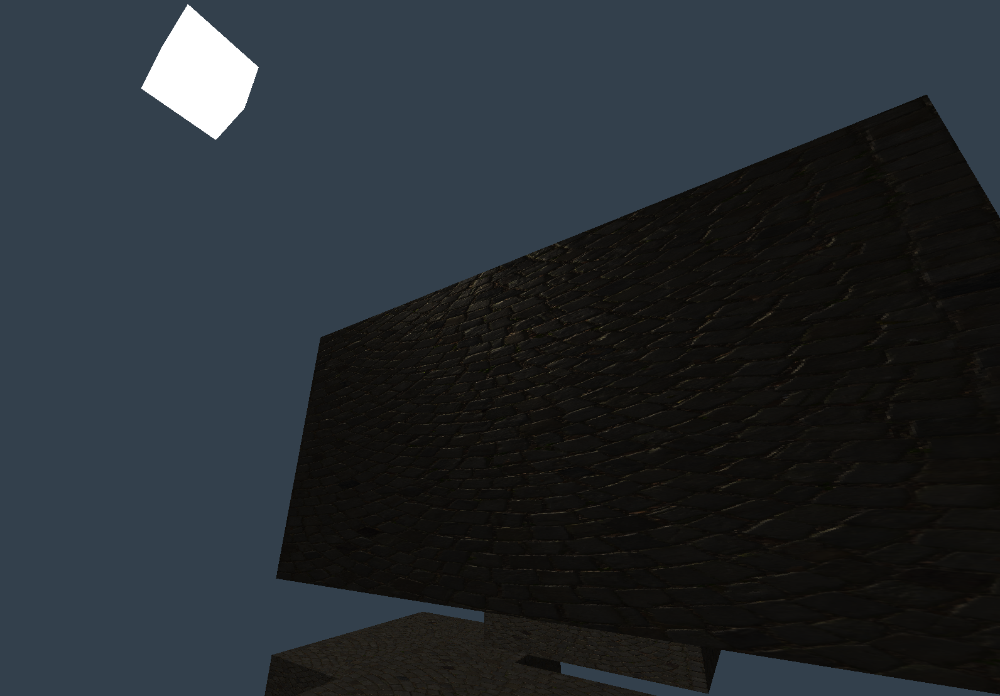

# Water Engine
The goal of this project is to create a small mesh/material viewer that also includes realistically rendered water. This engine is implemented using [physically based rendering](https://en.wikipedia.org/wiki/Physically_based_rendering) and IBL. 
Meshes and/or materials will be viewable above an ocean-like plane with waves simulated using FFT, in addition to IBL and ray-traced reflections of the viewed mesh.

Additionally, I'm looking to add rendering techniques like:
- Parallax occlusion mapping & self-shadowing
- Shadow mapping
- DLSS/DLAA
- Anything else that's often found in modern engines

It will be built off of the water shading logic I wrote [here](https://www.poshbrolly.net/shader/l0Ty1LFCvmCia8MqWn7C), but improved.

The overall goal is to learn as much as possible. lesgo

# Showcase
## 02-26-2026
- Got parallax mapping supposedly working, though it's difficult to tell
- Next is POM (Parallax Occlusion Mapping, uses raymarching)

<video width="320" height="240" controls>
  <source src="./showcase/parallax.mp4" type="video/mp4">
</video>
## 02-25-2026
- Just got normal mapping working fully
- Next is either parallax mapping or IBL

