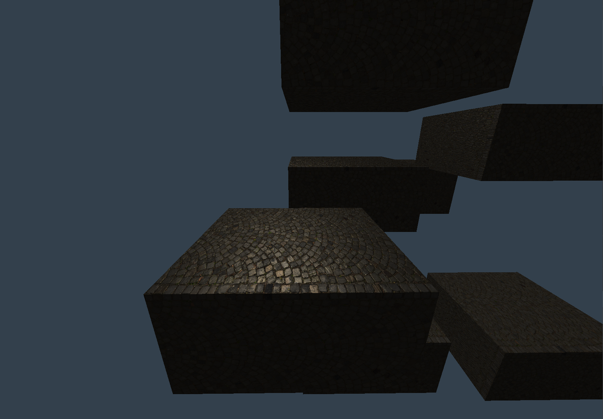
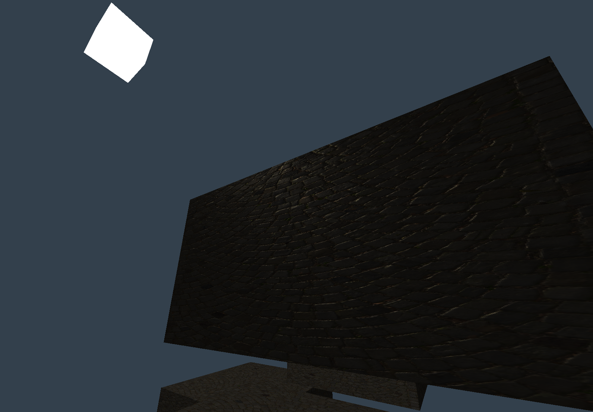

# Water Engine
The goal of this project is to create a small mesh/material viewer that also includes realistically rendered water. This engine is implemented using [physically based rendering](https://en.wikipedia.org/wiki/Physically_based_rendering) and IBL. 
Meshes and/or materials will be viewable above an ocean-like plane with waves simulated using FFT, in addition to IBL and ray-traced reflections of the viewed mesh.

Additionally, I'm looking to add rendering techniques like:
- Parallax occlusion mapping & self-shadowing
- Shadow mapping
- DLSS/DLAA
- Anything else that's often found in modern engines

It will be built off of the water shading logic I wrote [here](https://www.poshbrolly.net/shader/l0Ty1LFCvmCia8MqWn7C), but improved.

The overall goal is to learn as much as possible. lesgo

# Showcase
## 03-09-2026
- Parallax mapping was not working previously, several bugs in shader relating to displacement calculation that are now fixed.
- Working now, but current method insufficient for the high-frequency paving stones texture, shown below. Will need POM

## 02-26-2026
- Got parallax mapping supposedly working, though it's difficult to tell
- Switched to parallax mapping with offset limiting
- Next is POM (Parallax Occlusion Mapping, uses raymarching)

Note the texture swimming at sharp angles:
https://github.com/user-attachments/assets/030e10a9-6f3d-42c9-b2c7-9b88df5e5bbf

## 02-25-2026
- Just got normal mapping working fully
- Next is either parallax mapping or IBL

